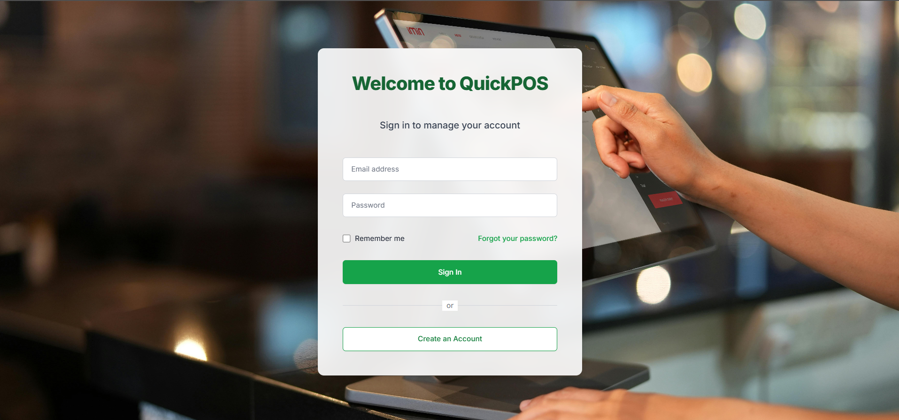
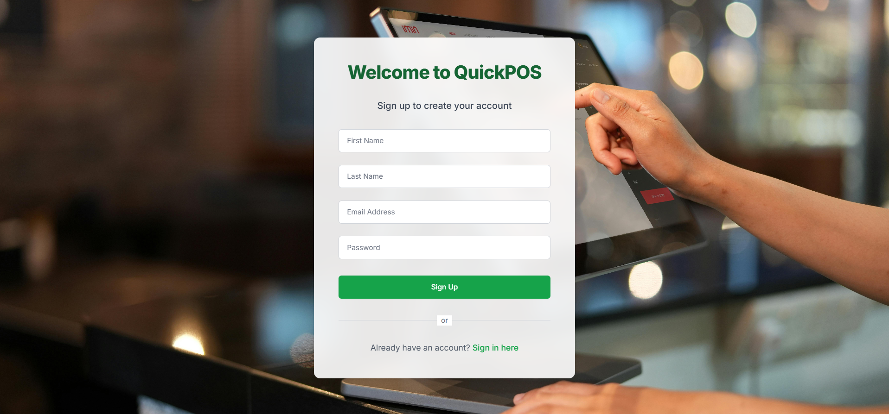
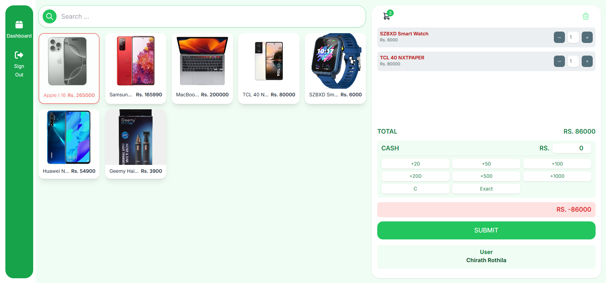
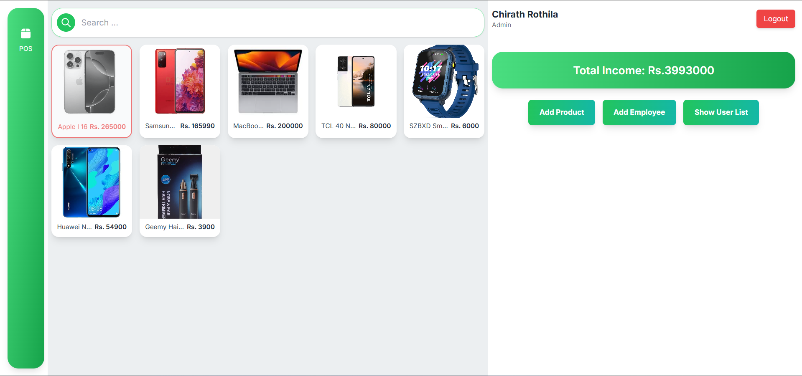

# 🚀 QuickPOS - Web Based POS System

QuickPOS is a modern, responsive, and efficient Web Based Point of Sale (POS) system built with **React.js**, **TypeScript**, and **Tailwind CSS**. This system is designed to help businesses manage sales, inventory, and customer data seamlessly via an intuitive web interface.

---

## 🌟 Features

- 🔐 Secure User Authentication (Login/Logout)
- 🛒 Product & Inventory Management
- 📦 Stock Level Monitoring
- 💰 Sales Processing (Add to Cart, Checkout)
- 📊 Sales Dashboard & Analytics
- 🎨 Responsive & Clean UI using Tailwind CSS

---

## 🛠️ Tech Stack

- **Frontend**: React.js (with TypeScript)
- **Styling**: Tailwind CSS
- **State Management**: React Context API
- **API Communication**: Axios / Fetch API
- **Routing**: React Router DOM

---

## 📸 UI Screenshots

### 🔐 Sign In

### 📝 Sign Up

### 🏠 Home

### 🛠️ Admin Panel

### ➕ Add Product

### 👥 Add Employee

### 🧑‍💼 Manage Employees

### 📦 Stock Update

